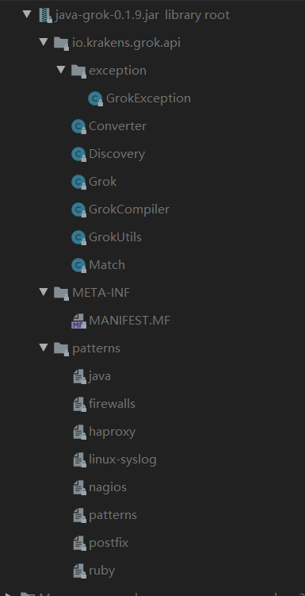

## 后续思考 以及对 java-grok 源码的解析

### java-grok的目录：




### java-grok使用的依赖：

```xml
  <dependencies>
      <!-- https://blog.csdn.net/f641385712/article/details/82468927 -->
      <!-- Apache的Jakarta commons工程下具有一系列公共基础类。 -->
    <dependency>
      <groupId>org.apache.commons</groupId>
      <artifactId>commons-lang3</artifactId>
      <version>3.7</version>
      <scope>compile</scope>
    </dependency>
      <!-- 这个不用多说 测试依赖 -->
    <dependency>
      <groupId>junit</groupId>
      <artifactId>junit</artifactId>
      <version>4.12</version>
      <scope>test</scope>
    </dependency>
      <!-- https://skyao.gitbooks.io/learning-java-unit-test/content/assertj/ -->
      <!-- AssertJ是一个Java库，提供了流式断言,更接近自然语言。其主要目标是提高测试代码的可读性，使测试更容易维护。 -->
    <dependency>
      <groupId>org.assertj</groupId>
      <artifactId>assertj-core</artifactId>
      <version>3.9.1</version>
      <scope>test</scope>
    </dependency>
      <!-- 优点类似于 上面个的commons-lang3 -->
      <!--  Guava 是由Google开发的基于Java的开源库，包含许多Google核心库，它有助于最佳编码实践，并有助于减少编码错误。 -->      
    <dependency>
      <groupId>com.google.guava</groupId>
      <artifactId>guava</artifactId>
      <version>24.0-jre</version>
      <scope>test</scope>
    </dependency>
  </dependencies>

```

> 根据 `scope` 标签可以知道上面四个依赖 ，其实有三个是测试时用的，实际上实现功能仅依靠java 正则API与commons工具库。

### 底层思路简介

先从介绍开始吧，整个项目是将 Logstash 中的 Grok 插件的功能抽取成java来实现的。由于当时 Logstash是作为ELK产品线中的流数据处理中间件，必定要涉及到日志的解析，于是为之开发了Grok插件。解析原理是使用正则表达式来匹配日志每行日志，然后将匹配结果进行输出。当然没有哪个产品会让用户自己去写正则表达式，于是Grok插件自定义了一些正则。并将其分为不同的文件，请参照[patterns][patterns]。为了能让一个插件解析各式各样的日志，需要用户根据[Groke语法][plugins-filters-grok]来传入表达式，例如这样配置：

```json
filter {
    grok {
        match => {
            "message" => "%{WORD} %{NUMBER:request_time:float} %{WORD}"
        }
    }
}
```

插件就会根据默认的一些正则文件，将`%{WORD} %{NUMBER:request_time:float} %{WORD}`转换为 `"\s+(?<request_time>\d+(?:\.\d+)?)\s+"` 然后通过正则来处理每一行的日志文件，但由于大部分是由ruby与python实现的，因此就有大佬将整个插件的功能抽取出来，用java来实现，也就是现在这个`java-grok`。


转到java层面，在`java.util.regex`包下面，也有一系列处理正则的API，例如用来封装正则规则的对象`Pattern`，以及保存匹配结果的对象`Matcher`。具体使用是通过`.compile(regex)`的方法，将正则表达式转换为模式对象(`Pattern`)，然后通过`Pattern.matcher(string)`方法，将字符串与模式对象互相匹配并生成一个匹配器(`Matcher`)，对象里面包含了符合模式规则的所有字符串，这一步的底层是通过java.lang中的[character sequence](https://docs.oracle.com/javase/8/docs/api/java/lang/CharSequence.html)接口作为解释引擎来解释`Pattern`，然后通过`Matcher.group()`来获得我们匹配的一组结果。


1. 通过`GrokCompiler.registerPatternFromClasspath()`加载正则配置文件 如：

```json
POSINT \b(?:[1-9][0-9]*)\b
NONNEGINT \b(?:[0-9]+)\b
USERNAME [a-zA-Z0-9._-]+
USER %{USERNAME:UNWANTED}
IPORHOST (?:%{HOSTNAME:UNWANTED}|%{IP:UNWANTED})
```

然后创建文件流，按照编写语法设置正则匹配，将文件中的内容匹配为 Matcher 对象，然后通过 `GrokCompiler.register()` 方法将 Matcher 中的每一组匹配存为 中的  Map 对象 `grokPatternDefinitions:`

```
{POSINT="\b(?:[1-9][0-9]*)\b",NONNEGINT="\b(?:[0-9]+)\b",.....}
```


2. 通过 `GrokCompiler.compile()` 解析传入Grok规则的表达式，例如传入 `pattern` 为`%{POSTINT:pid} %{IPORHOST:ip}` 

对 `pattern` 进行初步解析：

```json
{POSTINT:pid},{IPORHOST:ip{IP:null}|{HOSTNAME:null}} 
```

将 `pattern` 进行替换，保存为 `patternDefinitions`：

```json
{POSTINT}{IPORHOST=(?:%{IP}|%{HOSTNAME})}
```

通过字符串替换 Grok 语法中的 `"%{XX}"` 保存为`namedRegex`：

```json
(?<name0>\b(?:[1-9][0-9]*)\b?)(?<name1>(?<name2>..regx..?)(?<name3>..regx..?)?)
```

同时维护了一个Map，`namedRegexCollection`：

```json
{name0=pid,name1=ip,name2=IP,name3=HOSTNAME}
```

这样，只需要通过 `namedRegex` 解析日志，然后找到每个 `nameX` 所对应的真实值，便可以解析日志。

`GrokCompiler` 最后返回一个 `Grok(pattern,namedRegex,namedRegexCollection,patternDefinitions,本地时区用来解析时间)`


3. 通过 `Grok.match()` 方法来解析日志，会使用 `Pattern.compile(namedRegex)` 来创建一个正则模式对象`compiledNamedRegex`，然后使用`Pattern.matcher(text)` 生成一个匹配容器 `Matcher`，将这些信息交给 `Match` 处理
4. 使用 `Match.capture()` 方法输出结果

将 `Matcher` 中的各个匹配结果保存为 Map，

```json
{name0=Jul  5 16:00:20, name1=Jul, name2=5, name3=16:00:20, name4=16, name5=00, name6=20, name7=boray01}
```

通过 `Grok.getNamedRegexCollection` 获取，每个`name`对应的变量别名，然后存为新的map返回。

### 工程结构

- `resource/patterns` ：里面是一些常用的正则表达式，与grok插件中使用的一致[patterns][patterns]，当需要使用匹配IP的正则表达式时，可以从文件中，加载已经定义好的表达式。
- `GrokUtils`：用来提取 Matcher 中的结果、提取表达式中的name、定义Pattern的语义。
- `Converter`：用来将字符串转为对应的类型，可能后面会考虑到自动封装，但是该功能并没有完善好。
- `Discovery`：类似于[grokdebug][grokdebug]中的Discovery，传入日志文件，自动寻找最匹配的Grok语法，虽然这个功能并没有实现。
- `GrokeCompiler`：用来加载pattern、解析Grok语法、等等并创建Grok，相当于Grok的工厂。
- `Grok`：可以理解为一个多种信息的载体，其中的`match()` 方法，其实是将匹配容器Matcher交给Match来处理。
- `Match`：用来遍历 Matcher 容器中的结果，并将相应的结果封装为Map返回。
- `execption.GrokeExeception`：一个自定义的异常处理类。


## 总结

整个`java-grok`的底层实现与分析算是到此结束了。整个看下来，其实只要掌握了对`Java Regex API` 的深入理解与使用，然后理清整个Grok插件的工作过程，便可以实现 Grok 在java上的功能实现。值得学习的是，整个API的设计思想，逻辑的严谨性，以及学会使用自己的异常处理等等，这些规范，以及设计思想，是需要长期的积累，所以加油。


**相关代码以及功能的分析，请查看 Log Parser 中core包的注释。**


---

[patterns]:https://github.com/elastic/logstash/tree/v1.4.2/patterns
[plugins-filters-grok]:https://www.elastic.co/guide/en/logstash/current/plugins-filters-grok.html

[grokdebug]:https://grokdebug.herokuapp.com/
