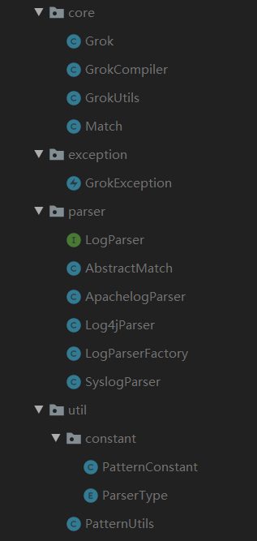

## 任务要求

写一个Log Parser的API，目标是可以解释相关的log文件，例如syslog，log4j等等。 需要解析以下3种的log文件，1和2是优先

1. syslog
2. apache log
3. log4j

一个syslog的文件已放在80.71:/home/中，你可用于测试

要求：功能和性能

## 个人理解

最开始以为是需要写一个Web接口，这样可以供第三方随便调用，往相应的接口传入待解析的日志，然后将我们的结果转为Json返回，通过后续的了解与测试，发现如果需要处理的日志量信息很大，通过HTTP的方式来调用接口是会浪费很多时间在网络开销上。而且再才领会了任务的真实需求，实际上是实现一个 Library，也就是类似于第三方Jar包，通过提供的API，来解析不同的日志。

## 解决思路

通过查看各个日志的内容，基本上每条日志内容只有一行，而且不同格式的日志，输出的数据也不同，只需要在相应的官网查看日志的输出格式或者日志的输出配置文件，便可以做到相应日志的解析。

以前也做过一些对字符串特征值提取的例子，最难的部分是，根据需求编写相应的正则表达式。我太菜了，并不想写正则表达式，又想到解析日志应该不是一个罕见的需求，肯定有相关的工具，于是通过万能的搜索引擎了解到了如下一些信息。

---

市面上有很多分析日志的框架与工具，如：（[Nagios][Nagios]、[Elastic Stack][Elastic Stack]、[Splunk][Splunk].....）等诸多工具与框架，有开源的，也有闭源的，目前我只大致了解了一下Elastic。

Elastic是一家上市的开源商业公司，公司的技术核心是四大组件：

- Elastic Search：Elastic产品栈的核心，是一个分布式的、开源的搜索分析引擎，支持各种数据类型，是基于Apache Lucene的，因为REST API、分布式特性、可扩展而闻名。
- Logstash：可以看作是一个流数据处理的中间件，负责把不同源头的原始数据预处理、转换为一个统一的格式，然后发送到ES存储起来。
- Beats：一系列轻量级的系统，负责收集各种信息，然后转发到ES或者Logstash。
- Kibana：一个跟整个技术栈深深整合的前端工具，帮组我们实现了数据的可视化，负责基本上所有的系统的交互，可以支持各种各样的数据查询、分析、可视化。

虽然我们不需要一套完整的ELK产品线，我们只需要利用Logstash的功能来解析日志就足够了。而Logstash是一个开源的产品，它作为流数据处理的中间件，富含很多插件，其中Grok则是最重要的插件之一[plugins-filters-grok][plugins-filters-grok]，我们可以在Grok里预定义好正则表达式，或者是自己编写的表达式来捕获与解析日志。虽然这个工具是Ruby写的，然而这个由于开源的特性，已经有大佬将相应的功能提取出来为[java-grok][java-grok]，虽然只能单行解析，但是基于Logstash已经如此成熟，其重要的Grok插件的生态也十分友好,这儿是grok的指南[ELKstack grok][ELKstack grok]，有了这完全足够应对各种情况了。

- [patterns ][patterns]: 列举了Grok中自带的一些匹配字段
- [grokdebug][grokdebug] : 一个用来测试自定义patterns的工具
- [正则表达式30分钟入门教程][正则表达式30分钟入门教程]：介绍了正则的语法，提供了在线测试功能

有了这些，我们就可以根据不同的日志，设计不同的Patterns匹配格式，然后每行读取日志文件，利用Grok来解析，最后对解析结果进行相应的输出，开始实现。

## 具体实现

[API 使用请参考 使用介绍](./使用介绍.md)

### 工程结构：

### core 包

用来存放底层的具体功能实现

### exception 包

用来存放处理异常的类

### parser 包

用来统一接口的功能，并且实现不同日志的相应功能，将共有的代码提取为抽象类，通过实现工厂方法，来完成不同接口的初始化与创建。

### util 包

用来存放一些常量，例如一些规格日志的通用表达式，Log4j中语法的对应字段，枚举一些API支持的日志格式等。

## 收获

主要是整个 API 的层次结构，相关的功能请参考代码以及代码中的注释，可以通过查看 Test 代码来熟悉 API 的使用。

## 拓展

[java-grok源码解析](./java-grok源码解析.md)

---

[Nagios]:https://www.nagios.org/about/
[Elastic Stack]:https://www.elastic.co/cn/products/
[Splunk]:https://www.splunk.com/en_us/careers/diversity.html
[plugins-filters-grok]:https://www.elastic.co/guide/en/logstash/current/plugins-filters-grok.html
[ELKstack grok]:https://elkguide.elasticsearch.cn/logstash/plugins/filter/grok.html
[java-grok]:https://github.com/thekrakken/java-grok
[patterns]:https://github.com/elastic/logstash/tree/v1.4.2/patterns
[grokdebug]:https://grokdebug.herokuapp.com/

[5 useful open source log analysis tools]:https://opensource.com/article/19/4/log-analysis-tools

[正则表达式30分钟入门教程]:https://deerchao.cn/tutorials/regex/regex.htm

